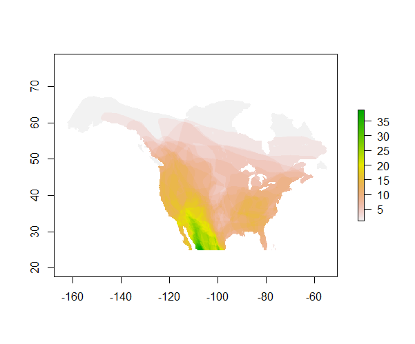

#Background

##Bats

###General information

Bats (Order Chiroptera), are the only group of mammals that are capable of flight.
characteristics of wings and flight adaptations (also physiology)

This group is one of the most diverse order of mammals in the world with around 1240 species [@tudge2000variety], second only to rodents. main groups

####Adaptations for flight

Bats have several adaptations for flight [@norberg1998morphological]

reproduction

####Hibernation or migration

Most north-american bats hibernate during the winter, some species migrate regionally (140 to 350 miles), in order to get to central hybernacula. Some other bats however can migrate upto 1180 miles to get to warmer latitudes [@fleming2003ecology, @mcguire2012migratory] and avoid hibernating all together. Some species such as the silver-haired bats (*Lasionycteris noctivagans*) may migrate over 155 miles a day [@mcguire2012migratory]. In general bats that live in higher latitudes tend to be migratory whereas bats that live in lower latitudes usually don't migrate, this is partly due to colder temperatures in higher latitudes, but also there is a higher Temperature Annual Range in higher latitudes as seen in the graph below (data extracted from @hijmans2005very).

```{r,echo=FALSE,cache=TRUE, warning=FALSE, message=TRUE}
library(raster)
library(ggplot2)
bio <- getData('worldclim' ,  var='bio', res=10)
tdif<- (bio[[7]]/10)
zones <- init(tdif, v='y')
zones <- abs(zones)
z <- zonal(tdif, zones, 'mean', na.rm= TRUE)
z <- as.data.frame(z)
z2 <- zonal(tdif, zones, "sd", na.rm = TRUE)
z2 <- as.data.frame(z2)
z <- cbind(z, z2$sd)
colnames(z) <- c("Latitude", "meanT", "sd")
ggplot(z, aes(x = Latitude, y= meanT)) +  geom_ribbon(ymax = (z$meanT + z$sd), ymin = (z$meanT  - z$sd), fill = "gray") + geom_line() + theme_classic() +labs(x="Latitude", y= "Max temperature - Min temperature") +  ylim(c(0,60))
```

Bats in higher latitudes migrate to escape lower temperatures, which bring scarsity of invertebrates [@fleming2003ecology]. It has also been established that 

Most bats (around 70% of them) feed on invertebrates, other species are frugivores, or pollinators. Some very specialized groups of bats feed exclusively on blood.

periods of activity

echolocation

###Bats in northamerica
- General information about bats biology, taxonomy, and natural history.
main groups
no species by region
adaptations like hibernation in different areas
There are 51 species of bats in North-america, those bats belong to four distinct families [@bradley2014revised]. The patterns of diversity are shown in the map below, where we see that bats are more abundant in the southwestern portion of the United States [@jenkins2013global]

 

##Why Bats Matter

###Ecosystem services delivered by bats

- General information about bat ecosystem services (pollination, invertebrate control, seed dispersal)
- More detailed information about economic benefits of having bats in north america

###White nose syndrom

As we see in the map below [@USGS2016White]


- Where white nose syndrome is right now
- Sources on where to find updated information

##Bats in the Plumas National Forest

###Species present in the Plumas National Forest

Small description on each of the species

- *Myotis yumanensis* (Myyu)
- *Myotis californicus* (Myca)
- *Myotis ciliolabrum* (Myci)
- *Myotis volans* (Myvo)
- *Myotis lucifugus* (Mylu)
- *Parastrellus hesperus* (Pahe)
- *Lasiurus blossevillii* (Labo)
- *Myotis evotis* (Myev)
- *Antrozous pallidus*  **(Anpa)**
- *Eptesicus fuscus* (Epfu)
- *Lasionycteris noctivagans* (Lano)
- *Myotis thysanodes* **(Myth)**
- *Tadarida brasiliensis* (Tabr)
- *Lasiurus cinereus* (Laci)
- *Corynorhinus townsendii* **(Coto)**
- *Euderma maculatum* (Euma)
- *Eumops perotis* (Eupe)

####Product Occupancy map for species studied in the Plumas National Forest

###Bat species of Concern in the Plumas national Forest

Longer description of this species and reasons of why is a species of Concern

- *Antrozous pallidus*  **(Anpa)**
- *Myotis thysanodes* **(Myth)**
- *Corynorhinus townsendii* **(Coto)**

#Site Selection

##The importance in selecting heterogeneus environments

This often improves the representativeness of the sample by reducing sampling error. It can produce a weighted mean that has less variability than the arithmetic mean of a simple random sample of the population.

In computational statistics, stratified sampling is a method of variance reduction when Monte Carlo methods are used to estimate population statistics from a known population.

The reasons to use stratified sampling rather than simple random sampling include[1]

If the population density varies greatly within a region, stratified sampling will ensure that estimates can be made with equal accuracy in different parts of the region, and that comparisons of sub-regions can be made with equal statistical power. For example, in Ontario a survey taken throughout the province might use a larger sampling fraction in the less populated north, since the disparity in population between north and south is so great that a sampling fraction based on the provincial sample as a whole might result in the collection of only a handful of data from the north.

Randomized stratification can also be used to improve population representativeness in a study.

##Classifying Plumas National Forest into different environments

###Layers used to classify the Plumas National Forest

- Altitude (m.a.s.l)
- Burn intensity basal
- Burn intensity canopy
- Burn intensity soil
- Distance to fire edge
- Distance to roads
- Distance to water bodies
- Fire interval
- Vegetation type

###Methods used to classify the Plumas National Forest

- K-means

###Product GIS layer of the Plumas National Forest Classified into 5 different environments

- Raster, and shapefile of the classification of the Plumas National forest

###General Characteristics of the five types of environment

- Graphic output as a classification tree
- Table output as means and standard deviation of each of the variables for each environment type

##Stratified random site-selection

###Product 2000 stratified random points

- 400 points per habitat delivered in KML and shp formats
- Contemplates 200 sampling points per year for the next ten years, 40 points per habitat per year

#Acoustic monitoring

##Advantages and disadvantages of passive acoustic monitoring

- Acoustic bat detectors can be set anywhere
- Acoustic bat detectors can sample for days
- Acoustic bat detectors are not as accurate as mist nets
- Species detection are never 100% accurate

##Setting of the Pettersson D500x bat detector

- Importance of setting the detection time to 3 seconds
- parameter settings
- Set all programs of the detector to the same parameters to avoid field mistakes

##Installing a bat detector in the field

- Explanation of how to deploy the detector in the field

##Field measurements to be taken in the field

- Description of each of the measurements to be taken in the field
- Basal Area
- Canopy cover
- Ground cover

##Using sonobat to automatically classify bat calls into species

###Filter low quality calls

- How to automatically erase bad quality calls in order to diminish sonobat running time

###Classify bat calls

- How to batch-classify the calls for one site

###Interpret the results made by sonobat

- Reading sonobat's output files
- How to see which species are present according to sonobat

###Get sonobat's help to manually vet inconlcusive calls

- How to get sonobat's help to manually vet species that are uncertain to be present

# References