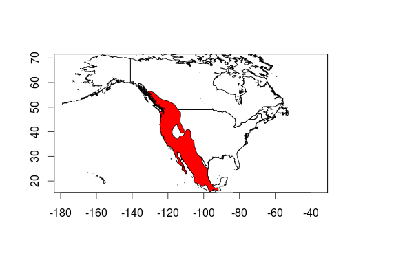

#Background

##Bats

###General information

Bats are one of the most diverse group of mammals with around 1240 species [@tudge2000variety; @schipper2008status], second only in number of species to rodents. The distinctive characteristic of this group is their ability to fly.

There are two main group of bats (see dendrogram bellow, extracted from @agnarsson2011time), the Megachiropterans, or flying foxes, which are large frugivorous bats that inhabit exclusively in the tropics. There are around 170 species of megachiropterans, they search their food using the sense of sight and smell and are mostly diurnal. The large flying fox (*Pteropus vampyrus*) is the largest species of bats and belongs to this group, which can have a wingspan of 1.7 meters (5 feet 7 inches). Within this group only the bats of the genus *Rosettus* use a very primitive form of echolocation, and are nocturnal.


Microchiropterans are the most diverse and specialized group of bats, and they live in every continent but Antarctica. Most of them are insectivores, but some of them are pollinators and some very specialized species are hematofagous or carnivorous. Usually these bats are a lot smaller than megachiropterans, they are nocturnal, and rely on echolocation to detect their preys and navigate through space

####Adaptations for flight

Chiropterans are the only mammals to achieve powered flight, bats have several adaptations for this [@norberg1998morphological]. It is supposed that ancient bats started flying around 50 million years ago [@cooper2012evolution], developing an enlarged hand with a thin membrane between the enlarged fingers, which is very different from the wings of birds. Little is known of the evolution of flight in bats, since the earliest fossils found of these groups were already winged [@gunnell2005fossil; @jepsen1966early]. However wings are not the only adaptation that bats and birds share, they both have higher metabolism and internal temperature than other flightless vertebrates of the same size, their bones are lighter, and have enlarged pectoral muscles that allow them to fly [@norberg1998morphological].

####reproduction

Bats a very diverse group, and their reproductive habits are very diverse aswell. One of the most peculiar aspect of bat reproduction is the differences between hibernating and nonhibernating bats.

Generally, in nonhibernating bats there is a synchrony between male and female reproductive processes [@krutzsch1979male]. Spermatozoa are most often produced and accessory sex glands are secretorily active at a time consistent with the onset of the oestrous cycle in the females. Copulation, ovulation and fertilization usually happens at the same time.

On the other hand, for hibernating bats there are two basic patterns of reproduction: type I and Type II. In reproduction of type I, oestrus and copulation are initiated in late summer and early autumn. Intermittent arousal and additional copulations may occur throughout the hibernation period. Spermatozoa are then stored in the female reproductive tract until spring when ovulation, fertilization and gestation takes place. The life span of spermatozoa in females is approximately the duration of the oestrus. When metabolism is greatly reduced (as in hibernation) storage could last longer [@crichton2000reproductive].

In bats with reproduction of type II, copulation ocurrs in autumn, and it is followed immediately by ovulation, fertilization and initial embryogenesis. The females enter hibernation in a pregnant condition without blastocysts implantation in their uteri. During hibernation, implantation is delayed and it does not occur until springtime [@oxberry1979female].

Female reproductive patterns based on if it has one, two or several reproductive seasons during the year (monoestry, bimodal polyoestry or polyoestry), and if females are or not synchronous in their reproductive cycle with other females of the same species (seasonal and aseasonal respectively) have been categorized in four broad categories : "aseasonal polyoestry", "seasonal polyoestry" [@beck1973reproductive], "bimodal polyoestry" [@fleming1971artibeus] and "seasonal monoestry" [@crichton2000reproductive; @ fleming1972three; @ wilson1973bat]. Polyestry typically results in the production of two litter a year and is a process frequently facilitated by the occurrence of a postpartum estrus [@myers1978sexual]. It is not clear whether the males in species in which the females are polyoestrous are reproductively active throughout the year [@krutzsch1979male].

Male reproductive activity may be accompanied by a wide variety of behavioral performances (vocalization, body movements, special flight patterns, roost defense) and secondary sexual structural characteristics (i.e. odoriferous secretions from dermal glad, pelage adornments, often associated with dermal glands and urinary track markings). These can be a significant part of the mating repertoire and it seems that the male reproductive pattern is determined by female reproductive receptivity [@crichton2000reproductive] and probably is under the control of testicular androgens with seasonal activity [@krutzsch1979male]

The social behavior of bats has made people think that most bat species are apparently polygamous, however a surprising number appear to be monogamous [@crichton2000reproductive], with some promiscuity, where females mates with several males [@mayer1995genetic].

####Hibernation or migration

Most north-american bats hibernate during the winter, but this is not true for all chiropterans. Some species migrate regionally (140 to 350 miles), in order to get to central hybernacula. Some other bats however can migrate up to 1180 miles to get to warmer latitudes [@fleming2003ecology, @mcguire2012migratory] and avoid hibernating all together. Some species such as the silver-haired bats (*Lasionycteris noctivagans*) may migrate over 155 miles a day [@mcguire2012migratory]. In general bats that live in higher latitudes tend to be migratory whereas bats that live in lower latitudes usually don't migrate, this is partly due to colder temperatures in higher latitudes, but also there is a higher Temperature Annual Range in higher latitudes as seen in the graph below (data extracted from @hijmans2005very).

```{r,echo=FALSE,cache=TRUE, warning=FALSE, message=TRUE}
library(raster)
library(ggplot2)
bio <- getData('worldclim' ,  var='bio', res=10)
tdif<- (bio[[7]]/10)
zones <- init(tdif, v='y')
zones <- abs(zones)
z <- zonal(tdif, zones, 'mean', na.rm= TRUE)
z <- as.data.frame(z)
z2 <- zonal(tdif, zones, "sd", na.rm = TRUE)
z2 <- as.data.frame(z2)
z <- cbind(z, z2$sd)
colnames(z) <- c("Latitude", "meanT", "sd")
ggplot(z, aes(x = Latitude, y= meanT)) +  geom_ribbon(ymax = (z$meanT + z$sd), ymin = (z$meanT  - z$sd), fill = "gray") + geom_line() + theme_classic() +labs(x="Latitude", y= "Max temperature - Min temperature") +  ylim(c(0,60))
```

Bats in higher latitudes migrate to escape lower temperatures, which bring scarcity of invertebrates [@fleming2003ecology]. It has also been established that there are important difference between sexes in terms of migration patterns, where in most species, females migrate more often and further away than males. There are several studies that show that there are different metabolic needs between males and females, since males spend more energy in autumn due to spermatogenesis, and females spend more energy in spring due to pregnancy and lactation, this would result in the differences in migration between them [@cryan2003sex].

####echolocation

Echolocation is a biological process exclusive to bats, toothed whales, and a few species of birds, it was a termed coined in 1938 by Griffin, who was the first author to thoroughly study the phenomenon [@griffin1941sensory].

The mechanism of echolocation is that the animal producess a sound, an then it bounces against an object, the intensity of the returning sound, plus the time difference between the returning sound at reaching both ears gives information regarding the distance and angle of the detected object [@jones2005echolocation].

Bats use this mechanism to detect their preys [@griffin1960echolocation], avoid obstacles, and even to detect water sources.  Most bat calls are beyond the human hearing range, and they range in frequency from 14,000 to well over 100,000 Hz.

Most species of bats produce very disctint calls, that has been used to detect and differenciate bat species by recording and analysing such calls as in the image below [@fenton1981recognition].


There is strong evidence that ancient bats did echolocate, and that megachiropterans lost that trait. Only to appear again in the only megachiropteran genus that navigates through sound [@jones2006evolution]

###Bats in northamerica

There are 51 species of bats in North-america, those bats belong to four distinct families (Molossidae, Mormoopidae, Phyllostomidae, and Vespertilionidae) [@bradley2014revised]. The patterns of diversity are shown in the map below, where we see that bats are more abundant in the southwestern portion of the United States [@jenkins2013global]

 

Of the 51 species present in northamerica, eleve  are federally endangered [@bogan1996diversity]. The bat species that are considered federally endangered are the Florida bonneted bat (*Eumops floridanus*), the gray bat	(*Myotis grisescens*) ,Hawaiian hoary bat (*Lasiurus cinereus semotus*), Indiana bat (*Myotis sodalis*), lesser long-nosed bat 	(*Leptonycteris curasoae yerbabuenae*), little Mariana fruit bat (*Pteropus tokudae*), Mariana fruit (*Pteropus mariannus mariannus*), Mexican long-nosed bat (*Leptonycteris nivalis*), Northern long-eared bat (*Myotis septentrionalis*), Ozark big-eared bat 	(*Corynorhinus townsendii ingens*), Pacific sheath-tailed bat (*Emballonura semicaudata rotensis*), Virginia big-eared bat (*Corynorhinus townsendii virginianus*). 

All northamerican species are insectivorous but three leaf-nosed bats species from the Phyllostomidae family, these species are dependent on nectar and pollen.

##Why Bats Matter

###Ecosystem services delivered by bats

Bats are very important economically in the world. Their most important benefit without a doubt is that they feed on invertebrates and thus they are one of the major natural pest controls for crops, since over two thirds of all bats are obligated insectivorous[@kunz2011ecosystem]. Due to their insect control, only in agriculture, it has been calculated that bats save farmers in the United States 72 dollars/acre [@boyles2011economic], which projects to an economic value of $22.9 billion dollars a year in the United States for the agricultural industry. 

At the same time there are bats that are pollinators of flowers, and there are other frugivorous bats that help spreading seeds [@kunz2011ecosystem]. Bat pollination occurs in about 528 species of angiosperms world-wide. Even though most of north american bats are insectivorous, in arid habitats two families of succulent plants, Agavaceae and Cactaceae, rely on bats to be pollinated. Several of those species are very importance economically in northern and central america and supply food, fiber, tools, soaps, and medicine to the community as well as being the base of the multimillion dollar industry of tequila [@forster2003columnar]. 


##Threats to bats

###White nose syndrom

The White Nose Syndrome (WNS) is a fatal bat disease produced by a fungus, the origin of its name is the white color left on the infected skin of the muzzle, ears, and wings of bats. The syndrome is characterized by the presence of abundant and delicate hyphae and conidia on bat muzzles, wing membranes, and/or pinnae [@blehert2009bat]. This disease usually causes aberrant behavior of bats during hibernation, including bats prematurely staging at hibernacula entrances, failure of bats to arouse normally in response to disturbance, and diurnal and mid-winter emergence [@langwig2012sociality].
The fungus that produces the disease its called  *Pseudogymnoascus destructans*. 

Until 2009 WNS was poorly understood, so it was necessary to compare the disease with other dermatological issues of bats [@meteyer2009histopathologic]. The same year, it was published that histological examination using microscope was needed to confirm the presence of the fungus [@meteyer2009histopathologic]. Even more, it was demonstrated that this wasn´t a typical disease where the fungus is an opportunistic pathogen, the exposure of healthy little brown bats (*Myotis lucifugus*) to pure cultures of *G. destructans* causes WNS [@lorch2011experimental]

*P. destructans* is capable of living at relatively low temperatures. Thermal performance curves generated for each isolate indicated thermal optima for growth between 12.5 and 15.8°C (54.5 to 60.44 °F) and an upper critical temperature for growth between 19.0 and 19.8°C (66.2 to 67.6°F) [@verant2012temperature], no growth at 24°C (75.2°F) or above [@gargas2009geomyces]. This makes this fungus to grow optimally at the temperatures found in winter bat hibernacula.  Bats are thought to have a lowered immune responses during hibernation torpor [@carey2003mammalian], this may predispose hibernating bats to infection by *P. destructans* [@gargas2009geomyces].

In general terms, novel pathogens introduced to new host communities can have devastating effects on wildlife populations, driving species to extinction and thereby decreasing biodiversity [@daszak2000emerging; @smith2006evidence]. To this date WNS has been estimated to have killed over five million North American bats [@verant2012temperature]. 

It has been shown that differences in temperature at locations within underground sites occupied by hibernating bats may influence both progression and severity of WNS among infected bats and environmental persistence and transmission of the fungus [@verant2012temperature]. Some models suggests that localized thermal refugia of 28°C (82.4°F) could improve survival by up to 75% [@boyles2009could]. It seems to be that in hibernating bats infected with *P. destructans* the impacts of disease on solitary species were lower, whereas in socially gregarious species declines were equally severe in populations spanning four orders of magnitude. However, as the populations of these gregarious species declined, a decrease in social group size was predicted that reduced the likelihood of extinction [@langwig2012sociality]

WNS is dispersing notoriously trough North America. The first evidence of WNS in bats was detected on February 2006 in New York, and it was documented by a photograph taken at Howes Cave, 52 km west of Albany [@blehert2009bat].  Until 2009, the disease was present only in the northeastern United States and it was confirmed at 33 sites in Connecticut, Massachusetts, New York, and Vermont [@blehert2009bat]. 
 
The USGS detected  cases of WNS in Michigan and Wisconsin IN 2014, and on 2016 in the first case was detected in the west coast in the State of Washington  (see the map below [@USGS2016White]). 

A new study indicates that six *Pseudomonas* isolates can inhibit the growth of *P. destructans* in vitro and should be studied further as a possible probiotic to protect bats from white-nose syndrome [@hoyt2015bacteria].


###Eolic energy and bats

Besides WNS, the biggest threat to bats in north america is wind turbines. Every autumn high mortality occur when migrating bats crash into this turbines [@cryan2011wind].
In a review of all multiple mortality events, defined as events where more than 10 bats died at a specific location on the same date, it was estimated that wind turbines have been the cause of more cumulative multiple mortality events than any other reason, followed closely by WNS [@o2016multiple]. From 2003 to 2013 at least 5,626 bats of 27 species in 18 countries where registered to have died in wind turbines [@rodrigues2015guidelines], and this should be only a fraction of the likely mortality, with estimations of 888,000 bat deaths only in north america for the year 2012 [@smallwood2013comparing]. It is also important to note that mortality in not equally distributed among bat species most deaths that happen in wind turbines correspond to migratory species that roost in trees [@arnett2008patterns].


##Bats in the Plumas National Forest

###Species present in the Plumas National Forest

For California, as we see in the map below, the Plumas National Forest is on a low diversity area, but we can still detect 17 different species there.


Small description on each of the species

- *Myotis yumanensis* (Myyu) 
    + Wingspan: 235 mm
    + Feeding: moths, midges, caddisflies, craneflies, beetles and other various small insects 
    + Biomes: desert or dune, savanna or grassland, chaparral, forest


- *Myotis californicus* (Myca)
    + Wingspan:
    + Feeding: flies, moths and beetles
    + Biomes: desert or dune, forest, mountains



- *Myotis ciliolabrum* (Myci)
    + Distribution:
    + Wingspan:
    + Feeding:
    + Biomes


- *Myotis volans* (Myvo)
    + Distribution:
    + Wingspan:
    + Feeding:
    + Biomes


- *Myotis lucifugus* (Mylu)
    + Distribution:
    + Wingspan:
    + Feeding:
    + Biomes


- *Parastrellus hesperus* (Pahe)
    + Distribution:
    + Wingspan:
    + Feeding:
    + Biomes
    
- *Lasiurus blossevillii* (Labo)
    + Distribution:
    + Wingspan:
    + Feeding:
    + Biomes
    
- *Myotis evotis* (Myev)
    + Distribution:
    + Wingspan:
    + Feeding:
    + Biomes
    
- *Antrozous pallidus*  **(Anpa)**
    + Distribution:
    + Wingspan:
    + Feeding:
    + Biomes
    
- *Eptesicus fuscus* (Epfu)
    + Distribution:
    + Wingspan:
    + Feeding:
    + Biomes

- *Lasionycteris noctivagans* (Lano)
    + Distribution:
    + Wingspan:
    + Feeding:
    + Biomes
    
- *Myotis thysanodes* **(Myth)**
    + Distribution:
    + Wingspan:
    + Feeding:
    + Biomes
- *Tadarida brasiliensis* (Tabr)
    + Distribution:
    + Wingspan:
    + Feeding:
    + Biomes
- *Lasiurus cinereus* (Laci)
    + Distribution:
    + Wingspan:
    + Feeding:
    + Biomes
- *Corynorhinus townsendii* **(Coto)**
    + Distribution:
    + Wingspan:
    + Feeding:
    + Biomes
    
- *Euderma maculatum* (Euma)
    + Distribution:
    + Wingspan:
    + Feeding:
    + Biomes
    
- *Eumops perotis* (Eupe)
    + Distribution:
    + Wingspan:
    + Feeding:
    + Biomes

####Product Occupancy map for species studied in the Plumas National Forest

###Bat species of Concern in the Plumas national Forest

Longer description of this species and reasons of why is a species of Concern

- *Antrozous pallidus*  **(Anpa)**
- *Myotis thysanodes* **(Myth)**
- *Corynorhinus townsendii* **(Coto)**

#Site Selection

##The importance in selecting heterogeneus environments

This often improves the representativeness of the sample by reducing sampling error. It can produce a weighted mean that has less variability than the arithmetic mean of a simple random sample of the population.

In computational statistics, stratified sampling is a method of variance reduction when Monte Carlo methods are used to estimate population statistics from a known population.

The reasons to use stratified sampling rather than simple random sampling include[1]

If the population density varies greatly within a region, stratified sampling will ensure that estimates can be made with equal accuracy in different parts of the region, and that comparisons of sub-regions can be made with equal statistical power. For example, in Ontario a survey taken throughout the province might use a larger sampling fraction in the less populated north, since the disparity in population between north and south is so great that a sampling fraction based on the provincial sample as a whole might result in the collection of only a handful of data from the north.

Randomized stratification can also be used to improve population representativeness in a study.

##Classifying Plumas National Forest into different environments

###Layers used to classify the Plumas National Forest

- Elevation (m.a.s.l)
- Burn intensity basal
- Burn intensity canopy
- Burn intensity soil
- Distance to fire edge
- Distance to roads
- Distance to water bodies
- Fire interval
- Vegetation type

###Methods used to classify the Plumas National Forest

- K-means

###Product GIS layer of the Plumas National Forest Classified into 5 different environments

- Raster, and shapefile of the classification of the Plumas National forest

###General Characteristics of the five types of environment

- Graphic output as a classification tree
- Table output as means and standard deviation of each of the variables for each environment type

##Stratified random site-selection

###Product 2000 stratified random points

- 400 points per habitat delivered in KML and shp formats
- Contemplates 200 sampling points per year for the next ten years, 40 points per habitat per year

#Acoustic monitoring

##Advantages and disadvantages of passive acoustic monitoring

- Acoustic bat detectors can be set anywhere
- Acoustic bat detectors can sample for days
- Acoustic bat detectors are not as accurate as mist nets
- Species detection are never 100% accurate

##Setting of the Pettersson D500x bat detector

- Importance of setting the detection time to 3 seconds
- parameter settings
- Set all programs of the detector to the same parameters to avoid field mistakes

##Installing a bat detector in the field

- Explanation of how to deploy the detector in the field

##Field measurements to be taken in the field

- Description of each of the measurements to be taken in the field
- Basal Area
- Canopy cover
- Ground cover

##Using sonobat to automatically classify bat calls into species

###Filter low quality calls

- How to automatically erase bad quality calls in order to diminish sonobat running time

###Classify bat calls

- How to batch-classify the calls for one site

###Interpret the results made by sonobat

- Reading sonobat's output files
- How to see which species are present according to sonobat

###Get sonobat's help to manually vet inconlcusive calls

- How to get sonobat's help to manually vet species that are uncertain to be present

# References