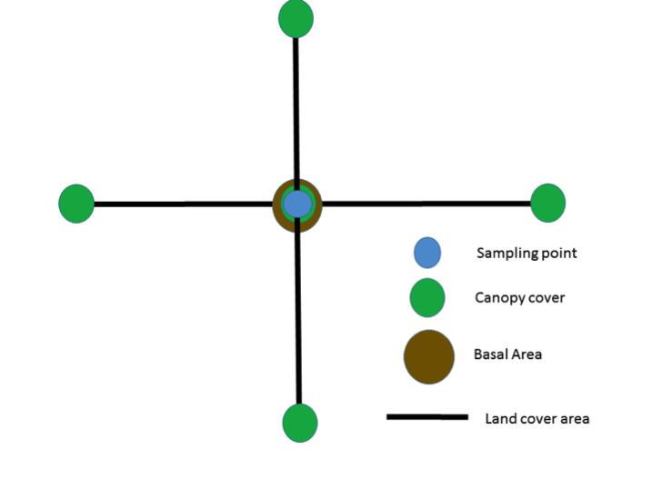
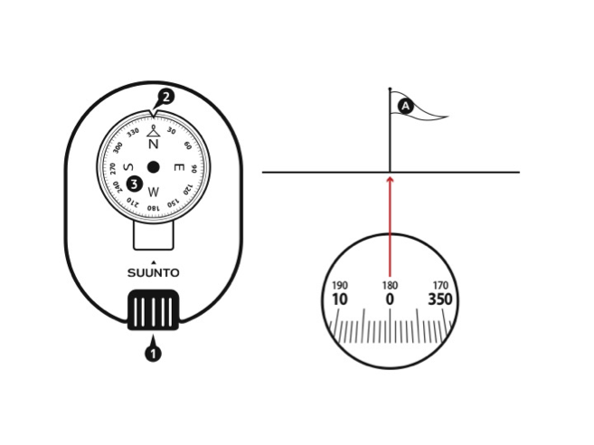
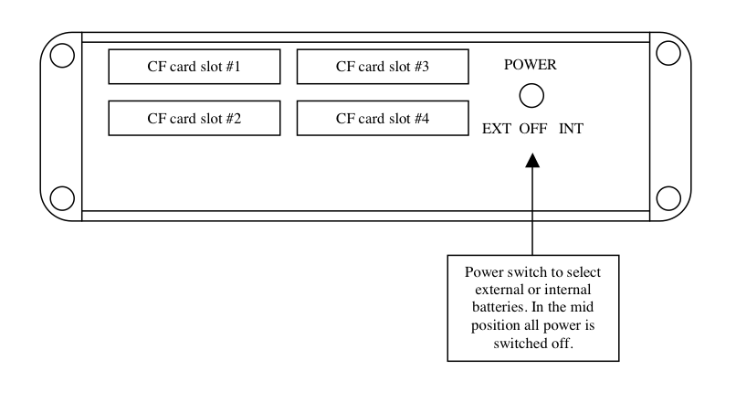
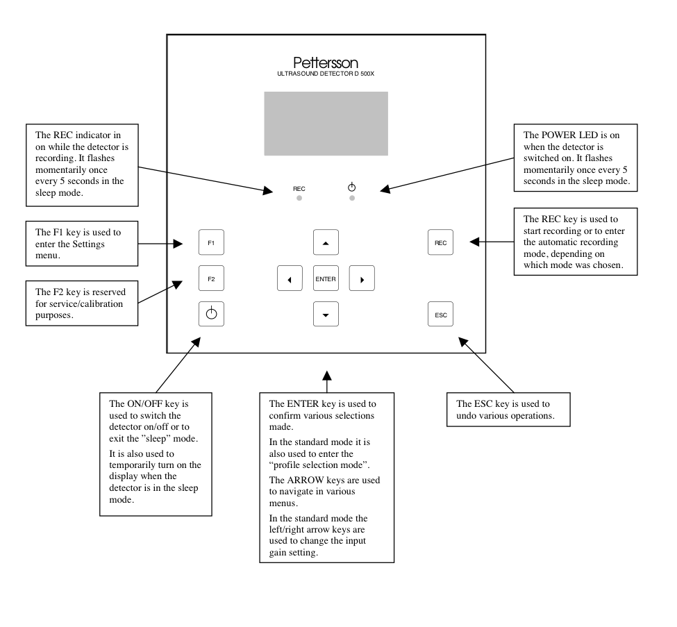
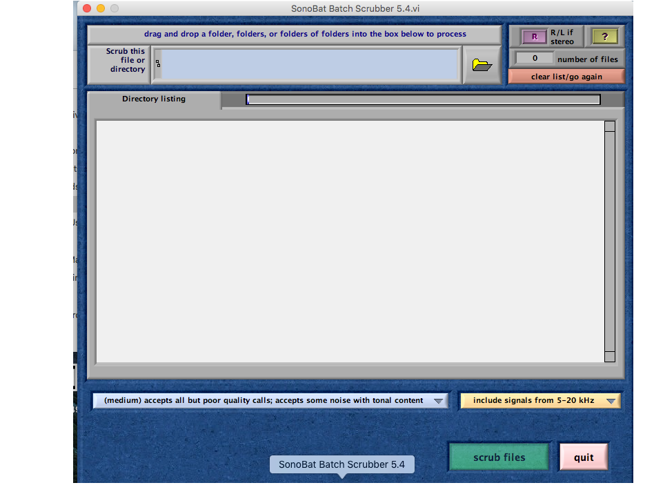

#Data collection

##Before you depart check that you have:

* A bat detector for each sampling point
* An ibutton for each sampling point
* Data sheet for each sampling point
* A three meter pipe for each sampling point
* An iron rod for each sampling point
* A clamp for each sampling point
* A mallet
* A wedged prism
* A diametrical tape
* A 50 mts measuring tape
* A densitometer
* Pencils
* Duct tape
* A GPS with all the sampling points
* A detailed map of the sampling points

##Getting to the sampling points

Head to the sampling points appointed for the day using the GPS and maps, once you get to the point use the mallet to stick an iron rod on the sampling point about half way through. This will help you to remember where the point is and it will be used later on to install the bat detector. 
Before putting up the detector, measurements of vegetation attributes will be measured from the sampling site filling the database at the end of this document; the measurements that will be taken are Canopy cover, land cover area and basal area. In the next paragraphs the sampling methods will be explained. In figure 1 a drawing of the sampling site is shown.

##Vegetation plot

###Canopy cover

####Description

The canopy cover is the percentage of overhead sky covered with canopy. This is measured with a gridded concave densiometer. These measurements are taken at 50 meters towards each of the four cardinal points from the sampling point and at the sampling point (figure 1).

####Activity

To use the densitometer, hold the instrument at 12 to 18 inches in front of you at elbow height, use the level bubble to make sure that the densiometer is flat. If the densiometer is in the right position you should be able to see your forehead in the mirror of the densiometer but it shouldn't overlap with the grid (Figure 2), you should also see a bubble within the drawn circle . 
For each one of the 24 squares in the grid imagine 4 equidistant dots and count the ones that are not in the open sky. Write down that number and repeat it for all of the 5 points in each sampling area.

###Land cover area

####Description

Land cover area, is the percentage of land covered by each vegetation type, in order to measure this the type of vegetation of 50 plots in each cardinal point will be determined from the sampling point.

####Activity

From the sampling point take the measuring tape and walk 50 meters straight with the compass, for every meter, determine visually the dominant Land cover in the following categories: woody growth, herbaceous growth, Grass, Naked Soil, Rocky Scree, Down wood or leaf Litter. 

#####Use of the compass to walk a straight line towards a cardinal point.

Place the compass horizontal to the ground and point towards the cardinal point you need to walk to. Place one of your eyes on the optics (figure 3), turn around until you find the needed number to follow, if you are heading South  that number will be 180, East 90, West 270, and North 0. Keeping both eyes open, use the eye you have in the optics of the compass to keep your bearing, and the other one to navigate through obstacles while you take the measuring tape to 50 meters of distance in that direction.
After that, go back looking in each meter interval. For each meter imagine a square of 1 by 1 meter and determine if the dominant land cover type as woody growth, herbaceous growth, Grass, Naked Soil, Rocky Scree, Down wood or leaf Litter. 

###Basal area

####Description

Basal area is the square meters per hectare covered by the trunk of a tree within the plot, this is measured using a diametrical tape to measure the diameter of the tree, and a wedge prism to check which trees are in or out of the vegetation plot.

####Activity

The first person stands in the sampling point and uses the wedge prism to check every tree starting on the north rotating in a clockwise direction in the spot.
To check weather a tree is in or out of the sampling plot, standing in the sampling point, look at a tree through the wedge prism; if the image of the tree trunk that you see in the prism overlaps with the one outside of the prism, the tree is in the vegetation plot, and it should be measured. If they don’t overlap, the tree is out of the vegetation plot and shouldn’t be measured (Figure 4).

##Acoustic monitoring

###Day 1 

####Setting of the Pettersson D500x bat detector

Open the lower case of the Petterson d500x (Figure 5) and Set the toggle to INT, carefully close the lower case To protect the memory cards.

In the front of the bat detector (Figure 6), press F1 and go to “RECORDING SETTINGS”, press enter, and set INPUT GAIN=80, TRIG LEV=80, INTERVAL=0, and press ENTER again. 
Return the detector to the box, close it, and leave only the microphone out trying to leave the box hidden from casual visitors.

Attach the microphone to the PVC pipe in the clamp, and attach the clamp to the metal pipe, then put the metal pipe in the iron rod set in the sampling point. Attach the ibutton to the box of the detector using duct tape. 

###Day 4

####Retrieving the detector

Return to the sampling point, open the box, and put the toggle in OFF before you do anything else. Make sure to put everything neatly in the box, and return with the detector, pipe, iron rod, clamp, ibutton and microphone.

##Extracting audio files from the CF cards

Once you have retrieved the bat detectors it is important to extract the audiofiles from the CF cards before you can classify the calls. The best way is to use the D500X  Utility Windows programs that facilitates the use of the CF cards with the detectors and can be downloaded from http://www.batsound.com. We recommend that you upgrade to the most recent version of the software, as older versions might not be fully compatible with current windows versions.

##Using sonobat to automatically classify bat calls into species

###Filter low quality calls

Besides the classification of bat calls sonobat has several utilities, such as the Batch Scrubber.

The Batch Scrubber will scan through a specified directory to recognize files lacking bat calls, for example files triggered by noise and move them into a directory named "Scrubbed Files" in the same directory as the searched files. In order to use the Scrubber just press the button that looks like a folder on the upper-right corner and select the folder with the files to scrub

###Classify bat calls

Sonobat uses 74 acoustic features to classify bats into different species, in the version of the program that classifies the western species in the US, the automatic classification of Sonobat has an average accuracy of 98.6, with no species being correctly classified in less than 96% of the time.

The easiest way of using sonobat for automatically classifying bat calls is using the batch classify feature after scrubbing the data (see previous section).

###Interpret the results made by sonobat

####Reading sonobat's output files

After a sonobat batch process, it will give back three different files: The BatchClassify, BatchSummary and the Nightly Summary. For most practical purposes the BatchSummary is the most useful file, and it's the one to use to determine the presence or absence of a species in a site.

####How to see which species are present according to sonobat

The Batchsummary has one column per species, and one row per interpretation to see if a species is present, as an example in the following table, we will focus in the first four columns of an example file, and tell which species are present according to sonobat. If we go through consensus which is the first row of the file, we see that *Myotis californicus* and *M. ciliolabrum*, and the same result applies for corrected count, but if we go by Likelihood of presence, the only present species would be Myotis californicus, since the likelihood is over 0.95. In order of least to most conservative measurements in this case you would count consensus count, corrected count and the most conservative one would be likelihood of presence.

  Measurement   | Myyu | Myca | Myci | Myvo | Mylu
----------------|------|------|------|------|------
Consensus count |    0 |    38|    10|    0 |    0
Corrected count |    0 |    36|     7|    0 |    0
Likelihood of P |    0 |     1|  0.93|    0 |    0
MLE             |    1 |     0|  0.07|    1 |    1 

###Get sonobat's help to manually vet inconlcusive calls

For species such as *Myotis ciliolabrum* above, since the likelihood of presence is bordering the threshold for presence, it might be good to manually vet the calls classified as that species and compare it to the database in Sonobat.

#Data Sheet